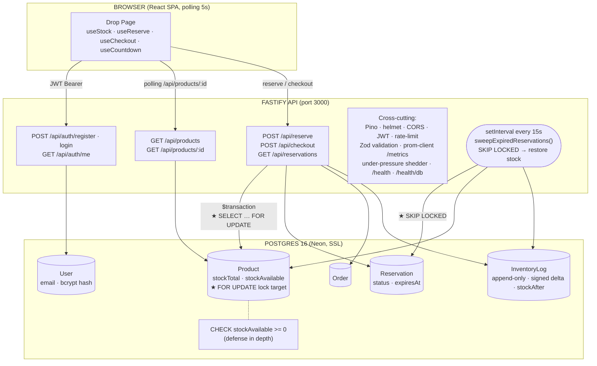

```mermaid
flowchart TB
  subgraph Client["BROWSER (React SPA, polling 5s)"]
    Drop["Drop Page<br/>useStock · useReserve · useCheckout · useCountdown"]
  end

  subgraph API["FASTIFY API (port 3000)"]
    direction TB
    Auth["POST /api/auth/register · login<br/>GET /api/auth/me"]
    Products["GET /api/products<br/>GET /api/products/:id"]
    Reserve["POST /api/reserve<br/>POST /api/checkout<br/>GET /api/reservations"]
    Plugins["Cross-cutting:<br/>Pino · helmet · CORS · JWT · rate-limit<br/>Zod validation · prom-client /metrics<br/>under-pressure shedder · /health · /health/db"]
    Sweeper(["setInterval every 15s<br/>sweepExpiredReservations()<br/>SKIP LOCKED → restore stock"])
  end

  subgraph DB["POSTGRES 16 (Neon, SSL)"]
    direction LR
    Product[("Product<br/>stockTotal · stockAvailable<br/>★ FOR UPDATE lock target")]
    Reservation[("Reservation<br/>status · expiresAt")]
    Order[("Order")]
    User[("User<br/>email · bcrypt hash")]
    Log[("InventoryLog<br/>append-only · signed delta · stockAfter")]
    Check["CHECK stockAvailable >= 0<br/>(defense in depth)"]
  end

  Drop -- "JWT Bearer" --> Auth
  Drop -- "polling /api/products/:id" --> Products
  Drop -- "reserve / checkout" --> Reserve

  Auth --> User
  Products --> Product
  Reserve -- "$transaction<br/>★ SELECT … FOR UPDATE" --> Product
  Reserve --> Reservation
  Reserve --> Order
  Reserve --> Log
  Sweeper -- "★ SKIP LOCKED" --> Reservation
  Sweeper --> Product
  Sweeper --> Log
  Product -.- Check
```
